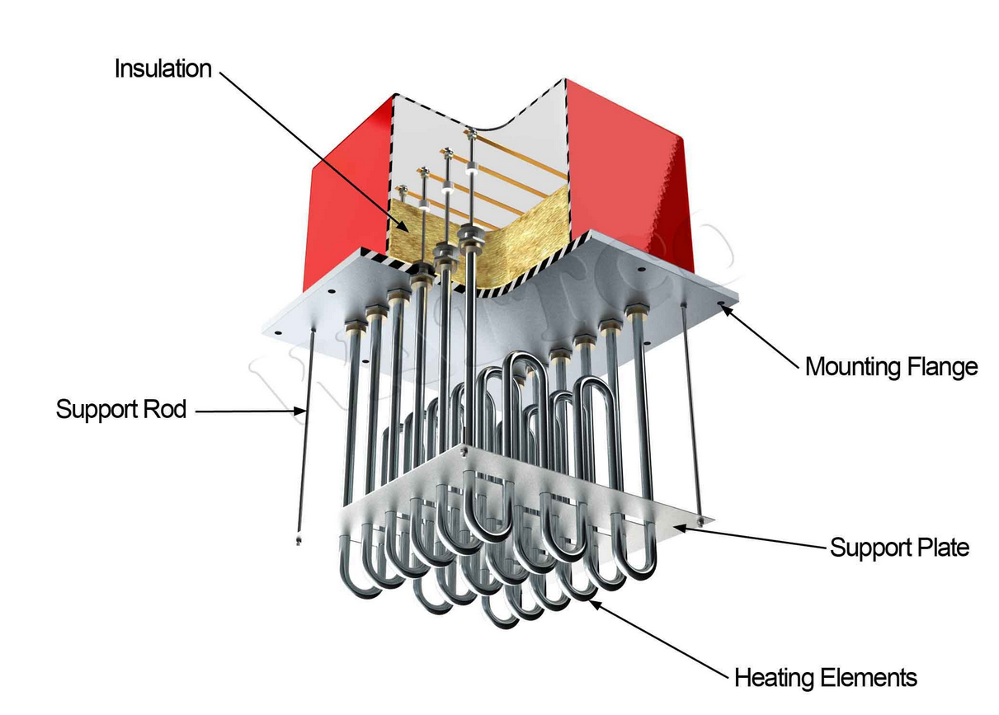

# 🔋 Thermal Battery Simulator


[](https://www.python.org/downloads/)
[](https://polyformproject.org/licenses/noncommercial/1.0.0)
[](https://www.riverbankcomputing.com/software/pyqt/)

A comprehensive 3D thermal simulation tool for designing and analyzing **thermal energy storage systems** (also known as "Sand Batteries"). This software enables engineers and researchers to visualize temperature distributions, optimize insulation design, and evaluate energy storage performance.



---

## 📋 Table of Contents

- [Features](#-features)
- [Project Goals](#-project-goals)
- [Architecture Overview](#-architecture-overview)
- [Installation](#-installation)
- [Quick Start](#-quick-start)
- [User Guide](#-user-guide)
- [Performance Optimization](#-performance-optimization)
- [Documentation](#-documentation)
- [Project Structure](#-project-structure)
- [Figures](#-figures)
- [Requirements](#-requirements)
- [Contributing](#-contributing)
- [License](#-license)

---

## ✨ Features

### Core Simulation
- **Cell-centred finite volume / FDM** solver for the heat equation
  (`src/solver/matrix.py`)
- **Steady-state and transient analysis** with a backward Euler implicit scheme
- **Iterative losses analysis** with a secant update of the heater power
- **Solver methods**: direct LU, CG, BiCGSTAB, GMRES (`src/solver/linear.py`);
  the GUI starts at **BiCGSTAB + Jacobi**, the plateaued `LinearConfig` default is
  direct LU, and the automatic mesh search uses CG + AMG Ruge-Stuben
- **Preconditioners**: none, Jacobi, ILU, AMG Ruge-Stuben, AMG smoothed
  aggregation (PyAMG); the AMG hierarchy is cached while the matrix is unchanged
- **CPU only**: the GPU backends were removed (see `CHANGELOG.md`)
- **Vectorised NumPy matrix assembly** (no JIT dependency, reference-tested)

### Geometry Modeling
- **Cartesian 3D mesh** with flexible dimensions (Lx, Ly, Lz)
- **Cylindrical storage region** centered in domain
- **Multi-layer insulation**: radial, top, and bottom slabs
- **Optional conical roof** for realistic industrial designs
- **Six heater patterns** (`HeaterPattern`): uniform zone (default), vertical
  grid, checkerboard, radial array, spiral, concentric rings
- **Six heat-exchanger tube patterns** (`TubePattern`): central cluster, radial
  array (default), grid, hexagonal, single central, custom
- **Buried pipe networks** (`src/core/pipes.py`, `src/core/pipe_network.py`):
  layouts (staggered bundle, square grid, concentric rings, radial files and a
  spiral), four collection modes (distributor + collector, reverse return, central
  header, two-level rings), pipe wall thickness/material and roughness, insulated
  headers, voxelisation of the network, hydraulics and the gas loop built from it -
  configured from the *Geometry > Pipes* tab, documented in
  [docs/15](docs/15_PIPE_NETWORKS.md)
- **Graded mesh from physical targets** plus an **automatic mesh search** that
  refines until the steady answer stops moving (`src/core/refinement.py`,
  `src/analysis/convergence.py`)

### Materials & Physics
- **Built-in material database**: steatite, silica sand, olivine, basalt,
  magnetite, quartzite, granite; rock wool, glass wool, calcium silicate,
  ceramic fibre, perlite; carbon steel, stainless steel, concrete
- **Packing fraction adjustment** for porous media
- **Convection, conduction, Dirichlet and Neumann boundary conditions**, each
  attached to its own face
- **Environment without an air domain**: `src/core/environment.py` gives the
  natural + wind film coefficients, and `mesh.excluded` / `mesh.h_out` put that
  film on the outer surface instead of spending cells on the air
- **Contact resistance** between materials (`mesh.h_contact`)
- **The gas loop** (`src/solver/fluid.py`): a 1-D closed loop through pipes in
  the bed, exact effectiveness relation, pressure drop, fan power
- **Cycle accounting** (`src/analysis/cycle.py`): charge, standby, discharge and
  where the energy goes
- **Energy and exergy balance calculations** with detailed loss analysis
- **Thermal autonomy estimation** based on stored energy and losses

### Analysis Types
- **Steady-State**: Equilibrium temperature distribution with constant power
- **Losses Analysis**: Iterative solver to find thermal losses at target temperature
- **Transient**: Time-dependent simulation with power and extraction profiles
- **Automatic mesh**: refines the graded grid until the *steady* answer stops
  moving (`src/analysis/convergence.py`, button *Find the mesh*)
- **Cycle accounting**: charge, standby and discharge through the gas loop, with
  the energy decomposition in `src/analysis/cycle.py`

### Transient Analysis
- **Power profiles**: off, constant, a time schedule, or a CSV file
- **Extraction profiles**: off, a fixed power, or a fluid flow rate
- **State save/load**: HDF5 format with geometry hash verification
- **Time-series results** with CSV export (full fields can be saved per sample for ParaView)

### Visualization
- **Interactive 3D visualization** with PyVista (degrades to a placeholder when
  no OpenGL context is available, `THERMAL_DISABLE_3D=1` forces that mode)
- **Four fields**: Temperature, Material, Sources, Conductivity
- **Slice planes** (x, y, z) with a position slider and an opacity slider
- **Geometry preview** driven by the same cut/opacity controls
- **Temperature display in Celsius**, colormap fixed to `coolwarm`, single vertical colorbar

### User Interface
- **PyQt6 GUI** with a left column of four tabs - *1. Geometry* (Cylinder,
  Insulation, Heaters, Tubes, Mesh, Pipes), *2. Materials* (Storage, Insulation,
  Conditions), *3. Analysis* (Type, Initial condition, Power, Extraction,
  Save/Load), *4. Tools* (Solver, Losses, Help)
- **Threaded simulation** - responsive UI during computation, cancellable
- **Results panel**: Statistics, Energy balance, Materials, Transient, Log
- **Save/Load simulation states** in HDF5 format
- **Exports**: the time-series CSV from the results panel; `src/viz/scene.py`
  provides `export_csv` / `export_vtk` field export for scripts (the window
  slots `export_vtk` / `export_csv_field` exist but are not wired to a button)

---

## 🎯 Project Goals

The **Thermal Battery Simulator** is designed to:

1. **Configure Complex Geometries**: Define dimensions, insulation layers, and placement of heat exchangers and heaters.

2. **Simulate Operating Scenarios**: analyse the steady state, the losses set point, or
   the time evolution with power and extraction profiles.

3. **Optimize Design**: Evaluate the impact of different materials and configurations on energy efficiency and thermal losses.

4. **Accessibility**: Make complex numerical simulation accessible through an intuitive graphical interface, eliminating the need to modify code for each test.

---

## 🏗️ Architecture Overview

The system follows a **GUI-driven design** where all simulation parameters originate from the user interface:

```
┌─────────────────────────────────────────────────────────────────┐
│                        GUI (PyQt6)                               │
│  ┌──────────────┐  ┌──────────────┐  ┌──────────────┐           │
│  │  Geometry    │  │  Materials   │  │   Analysis   │           │
│  │  - Lx,Ly,Lz  │  │  - storage   │  │  - type      │           │
│  │  - cylinder  │  │  - insulation│  │  - profiles  │           │
│  │  - heaters   │  │  - packing % │  │  - solver    │           │
│  └──────┬───────┘  └──────┬───────┘  └──────┬───────┘           │
└─────────┼──────────────────┼──────────────────┼─────────────────┘
          │                  │                  │
          ▼                  ▼                  ▼
┌─────────────────────────────────────────────────────────────────┐
│                    BatteryGeometry                               │
│         (Dataclass combining all configuration)                  │
└─────────────────────────────┬───────────────────────────────────┘
                              │
                              ▼
┌─────────────────────────────────────────────────────────────────┐
│                         Mesh3D                                   │
│            3D arrays: T, k, ρ, cp, Q, material_id                │
└─────────────────────────────┬───────────────────────────────────┘
                              │
                              ▼
┌─────────────────────────────────────────────────────────────────┐
│                 SteadyStateSolver / TransientSolver              │
│                    Solves A·T = b  (iterative)                   │
└─────────────────────────────┬───────────────────────────────────┘
                              │
                              ▼
┌─────────────────────────────────────────────────────────────────┐
│               3D Temperature Field + Energy Balance              │
└─────────────────────────────────────────────────────────────────┘
```

Where each piece lives (every path is in this repository):

| Concern | Module |
|---|---|
| grid, fields, per-face boundary conditions | `src/core/mesh.py` |
| index tables and cached face factors | `src/core/grid.py` |
| face conductances (harmonic mean, half cell, radiation) | `src/core/physics.py` |
| material database and packed-bed model | `src/core/materials.py` |
| vessel, heater and tube configuration, voxel painting | `src/core/geometry.py` |
| hairpin (U-shaped) heater bank and rasteriser | `src/core/heaters.py` |
| graded grid from physical targets | `src/core/refinement.py` |
| buried pipes and pipe networks | `src/core/pipes.py`, `src/core/pipe_network.py` |
| outside film without an air domain | `src/core/environment.py` |
| balanced octree with its own Laplacian | `src/core/octree.py` |
| assembly, linear backends, drivers | `src/solver/matrix.py`, `linear.py`, `steady.py`, `transient.py` |
| the gas loop (1-D, effectiveness relation) | `src/solver/fluid.py` |
| fluxes, balance, losses, mesh search, mesh plan, cycle | `src/analysis/fluxes.py`, `balance.py`, `losses.py`, `convergence.py`, `mesh_plan.py`, `cycle.py` |
| HDF5 state with a geometry hash | `src/io/state.py` |
| scene builders and exports | `src/viz/scene.py` |
| panels, controller, window | `gui/views/`, `gui/controller.py`, `gui/main_window.py` |
| figures of this documentation | `scripts/figures.py` |
| timings | `scripts/benchmark.py` |

---


## 🌡️ Units and conventions

* Inside `src/` every temperature is an **absolute temperature in Kelvin**;
  ambient/ground defaults are 293.15 K / 283.15 K.  The GUI works in degC and
  converts only in `gui/units.py`, so a unit mistake cannot hide in the physics.
* Powers are watts, energies joules, lengths metres, time seconds.
* Volumetric sources (`mesh.Q_source`) are `W/m^3`, sinks (`mesh.Q_sink`) are
  `W/m^3` and always negative.  The matrix coefficients are per unit volume.
* `check_kelvin()` rejects a field that looks like degC, and the mesh refuses to
  build a geometry whose roof or shell does not fit the domain.

## 💻 Installation

### Prerequisites
- Python 3.10 or higher
- Git (optional, for cloning)

### Step-by-step Installation

```bash
# 1. Clone the repository
git clone https://github.com/PhyTom/Thermal_battery_simulator.git
cd Thermal_battery_simulator

# 2. Create virtual environment
python -m venv .venv

# 3. Activate virtual environment
# On Windows:
.venv\Scripts\activate
# On Linux/Mac:
source .venv/bin/activate

# 4. Install dependencies
pip install -r requirements.txt
```

### Optional: PyAMG for AMG Preconditioner
```bash
pip install pyamg
```

---

## 🚀 Quick Start

### Launch the GUI
```bash
python run_gui.py
```

### Basic Workflow

1. **Configure Geometry** (*1. Geometry* tab, six sub-tabs)
   - *Cylinder*: domain (Lx, Ly, Lz), centre, storage radius and height, roof
   - *Insulation*: radial insulation, steel shell, bottom/top slabs, foundation
   - *Heaters*: total power (**5 kW** by default), pattern and element geometry
   - *Tubes*: heat-exchanger tubes (inactive by default)
   - *Mesh*: refined targets or a uniform cell size, plus *Find the mesh*
   - *Pipes*: buried pipe-network layout, collection mode and ducts

2. **Set Materials** (*2. Materials* tab)
   - *Storage*: medium (steatite by default) and packing fraction (63 %)
   - *Insulation*: insulation and shell material
   - *Conditions*: ambient 20 °C, ground 10 °C, `h_top` 10, `h_lateral` 5, radiation

3. **Configure Analysis** (*3. Analysis* tab)
   - *Type*: steady state, losses analysis, transient
   - *Initial condition*: uniform, per material, from an HDF5 state, or from steady
   - *Power* / *Extraction*: the transient profiles
   - *Save / Load*: HDF5 state with a geometry hash

4. **Configure Solver** (*4. Tools > Solver*)
   - Method (BiCGSTAB by default), preconditioner (Jacobi), tolerance, iterations
   - Threads (BLAS/OpenMP budget), radiation switch
   - *Tools > Losses*: the iteration controls of the losses analysis

5. **Build & Run**
   - *Build mesh* (runs the automatic mesh search first when it is enabled)
   - *Run* (the button text follows the selected analysis)
   - *Cancel* stops a running job at its next checkpoint

6. **Analyze Results** (right-hand panel)
   - Statistics, energy balance with the losses breakdown, materials, time series
   - Export the time series to CSV

---

## 📖 User Guide

### Geometry Configuration

The battery uses a **4-zone concentric structure**:

| Zone | Description | Typical Material |
|------|-------------|------------------|
| **STORAGE** | Central thermal mass | Steatite, Sand |
| **INSULATION** | Thermal barrier | Rock wool |
| **STEEL** | Structural shell | Carbon steel |
| **AIR** | External environment | Air |

**Key Parameters:**
- `r_storage`: Radius of storage zone [m]
- `insulation_thickness`: Insulation layer [m]
- `shell_thickness`: Steel shell [m]
- `height`: Total battery height [m]

### Heater Patterns

Six patterns (`HeaterPattern.ALL`), all of them rated by the surface power density
in W/cm² (3-8 for a sheathed element in a solid medium):

| Pattern | Description | Notes |
|---------|-------------|-------|
| **Uniform zone** (default) | Power spread over the whole storage volume | no discrete element |
| **Vertical grid** | A `grid_rows` x `grid_cols` bank of hairpins | regular layout |
| **Checkerboard** | The same `grid_rows` x `grid_cols` bank | the name survives from the rod-heater era; with hairpins it is the grid layout |
| **Radial array** | Elements distributed on `n_rings` concentric rings | ring count from the circumference and the leg spacing |
| **Spiral** | A rectangular bank sized from `n_heaters` (about `sqrt(n)` x `sqrt(n)`) | |
| **Concentric rings** | Elements on `n_rings` concentric rings | pairs with the tube rings |

A discrete pattern is a bank of flanged **hairpin (U-shaped) elements** with a
Ø12 mm stainless sheath, an active length in the sand and a cold shank through the
insulation (`src/core/heaters.py`).  Whatever the pattern, $\sum Q V$ equals the
total power exactly, and layouts the mesh cannot represent are refused (see
[docs/03](docs/03_GEOMETRY.md) §3).

### Tube Patterns

Six patterns, all painted inside the storage band with the shell material and the
internal convection of `h_fluid` / `t_fluid` ([docs/03](docs/03_GEOMETRY.md) §4):

| Pattern | Description | Notes |
|---------|-------------|-------|
| **Central cluster** | Group at the centre | small units |
| **Radial array** (default) | Rings of `n_tubes` tubes | large units |
| **Grid** | `grid_rows` x `grid_cols`, spacing `grid_spacing` | regular layouts |
| **Hexagonal** | Dense triangular packing | maximum wetted area |
| **Single central** | One central tube | check runs |
| **Custom** | Explicit positions | scripted studies |

### Mesh

The *Mesh* sub-tab builds the grid from **physical targets** (cells across the
storage radius, the insulation and the sheath; far-field size; growth ratio; cell
budget) and summarises the realised grid live.  *Find the mesh* runs the automatic
search: the same steady solve on progressively finer grids, stopping when the
storage mean temperature and the heat leaving the battery move by less than the
tolerances.  The uniform mode (one cell size everywhere) is still available and is
what the legacy comparisons use.

### Buried pipes

The *Pipes* sub-tab configures the gas-side network: layout (staggered bundle,
square grid, concentric rings, radial files), collection mode (distributor +
collector, reverse return, central header, two-level rings), ring/file counts,
pipe and duct diameters, inlet/outlet azimuths and the flow split.  *Build network*
rasterises it on the current mesh and reports the summary and the validation
warnings.  The design rules, parameters and worked examples are in
**[docs/15_PIPE_NETWORKS.md](docs/15_PIPE_NETWORKS.md)**.

---

## 🧭 Methods and why

The full rationale - each choice, the alternative that was rejected, and how it is
checked - is in **[docs/12_METHODS.md](docs/12_METHODS.md)**.  The short version:

| Question | Answer | Why not the alternative |
|---|---|---|
| Discretisation | cell-centred **finite volume** on a Cartesian grid | conservation holds on *any* grid, so the energy balance is a verification tool; finite differences lose that, body-fitted meshes cost far more complexity for this squat-cylinder geometry |
| Conductivity at a material interface | **harmonic mean** of the two cells | reproduces the exact series resistance of a two-layer wall; the arithmetic mean overestimates the flux by orders of magnitude when steel (50) meets rock wool (0.04) |
| Solver | **CG on the symmetrised system** + AMG | the physical operator is symmetric; writing it per unit volume destroys that, so the similarity transform `diag(V)^-1/2 K diag(V)^-1/2` restores it and keeps CG (and AMG) available on graded grids |
| Convective surfaces | half-cell conduction in series with the film | a "cell at the film temperature" would need the surface cell to be isothermal; the price is first-order accuracy at the surface, which is why the mesh search floors the observed order at 1 |
| Transient | **backward Euler**, adaptive step | unconditionally stable for a stiff sand/steel/insulation stack; Crank-Nicolson rings on the power steps this tool exists to simulate |
| Losses | **secant** iteration on the power | smooth monotone loss, no derivative needed, 3-6 iterations; bisection needs a bracket and is slower |
| Mesh | graded bands, **linear ramp** + density equidistribution | the linear ramp bounds the neighbour ratio by `growth` by construction; an exponential ramp looks shorter but its per-cell ratio grows with the cell size |
| Mesh size | **a priori plan** (`thickness/N`, `2k/h`) + **Richardson/GCI search** | the error model predicts the grid that meets the tolerance, so the search jumps there; "refine until two grids agree" is only valid for adjacent grids and rejects good ones after a jump |
| Reported uncertainty | **GCI** of the chosen grid (Roache, Fs = 1.25) | an unqualified number hides the discretisation error; ASME V&V 20 and Celik et al. (2008) prescribe exactly this reporting |

## ⚡ Performance Optimization

### Why is simulation slow?

Computation time depends on:
- **Number of cells**: $N = N_x \times N_y \times N_z$ (100×100×100 = 1 million cells!)
- **Solver method**: Direct methods are O(N^1.5), iterative are O(N)
- **Tolerance**: Tighter tolerances require more iterations

### Recommended Configuration by Scenario

Cost grows with the cell count, the number of iterations and the AMG setup, so run
`python scripts/benchmark.py` on your machine instead of trusting a table: the script
prints the assembly and solve times per mesh size (see [docs/14](docs/14_VERIFICATION.md)
for measured numbers on this repository's development machine).

| Scenario | Method | Preconditioner | Tolerance |
|----------|--------|----------------|-----------|
| Quick test | `bicgstab` | `jacobi` | 1e-4 |
| Visualization | `bicgstab` | `jacobi` | 1e-6 |
| Standard precision | `bicgstab` | `jacobi` | 1e-8 (GUI default) |
| Large graded meshes | `cg` | `amg_rs` (PyAMG) | 1e-8 |
| Reference answers, small meshes | `direct` | - | - |

The GUI opens at **BiCGSTAB + Jacobi, tolerance 1e-8, threads "All - 1"**; the
automatic mesh search solves with **CG + AMG Ruge-Stuben** because the graded operator
is symmetrised before the solve.

### Solver Methods

| Method | Description | When to Use |
|--------|-------------|-------------|
| **bicgstab** | BiCGSTAB | the GUI default; robust on the general (non-symmetric) operator |
| **cg** | Conjugate Gradient | symmetric systems only - refused with a note on anything else |
| **gmres** | GMRES | alternative for difficult systems, more memory per iteration |
| **direct** | Sparse LU | reference answers and small meshes; memory grows fast (see `scripts/benchmark.py`) |

> **Note on CG**: the operator is symmetric when every boundary condition is Neumann or
> Robin; a Dirichlet face is eliminated symmetrically (`apply_dirichlet`), and a graded
> mesh is symmetrised with `solve_linear(..., scale=V)`.  When symmetry still cannot be
> established the solver reports the substitution instead of diverging silently.

### Preconditioners

| Precond. | Description | Performance |
|----------|-------------|-------------|
| **jacobi** | Diagonal | the GUI default: multi-threaded and cheap |
| **none** | None | pure CG, often surprisingly fast |
| **ilu** | Incomplete LU | single-threaded (SuperLU), can be slow |
| **amg_rs** | AMG Ruge-Stuben (PyAMG) | best for large systems; the hierarchy is cached while the matrix is unchanged |
| **amg_sa** | AMG smoothed aggregation (PyAMG) | alternative coarse-grid choice |

> **Important**: the AMG hierarchy is the dominant setup cost.  It is rebuilt only when
> the matrix fingerprint changes, which is what makes the losses iteration and the
> transient stepping cheap.

### Built-in Performance Optimizations

- vectorised assembly (no Python loop over cells), one COO build per matrix;
- geometric face factors `A/(d_centers V)` cached per mesh in `GridIndex`;
- warm starts (`x0 = T^n`) and a cached preconditioner in the transient;
- the transient operator is rebuilt only when `dt` or the radiation linearisation changes.

### Tolerance Guide

| Value | Use Case | Notes |
|-------|----------|-------|
| 1e-10 | High precision | For validation and detailed analysis |
| 1e-8 | Default | Good speed/precision balance |
| 1e-6 | Fast | Sufficient for visualization |
| 1e-4 | Very fast | Only for quick tests |

### Multi-Threading

- **Auto**: Uses all CPU cores → maximum speed, may slow the system
- **All - 1**: the GUI default. Leaves one core free for the interface
- **N cores**: Limits the BLAS/OpenMP pool to N cores

### Practical Tips

1. **Start with small meshes** for quick tests
2. **Use BiCGSTAB + Jacobi** (the default) unless you know the system is symmetric
3. **Refine the mesh** only for final results - the automatic mesh search does it for you
4. **Tolerance 1e-6** is sufficient for visualization
5. **Check the energy balance** to validate results
6. **Raising the cell budget** is what the automatic mesh search usually asks for: the
   default 400 000-cell budget stops it before the near-wall gradient is resolved

---

## 📚 Documentation

Detailed documentation is available in the `docs/` folder:

| Document | Description |
|----------|-------------|
| [00_INDEX.md](docs/00_INDEX.md) | Index and how the documents are kept in sync |
| [01_THEORY.md](docs/01_THEORY.md) | Heat transfer fundamentals, packed bed, energy and exergy |
| [02_FDM_DISCRETIZATION.md](docs/02_FDM_DISCRETIZATION.md) | Discrete operators, boundary treatments, validation |
| [03_GEOMETRY.md](docs/03_GEOMETRY.md) | Zones, paint order, heater/tube patterns, validation rules |
| [04_GUI_DESIGN.md](docs/04_GUI_DESIGN.md) | Panels, run state machine, threading, results |
| [05_ARCHITECTURE.md](docs/05_ARCHITECTURE.md) | Layers, contracts, error handling, extension points |
| [06_GUI_CONFIGURATION.md](docs/06_GUI_CONFIGURATION.md) | Every control with default, range and unit |
| [07_CODE_STRUCTURE.md](docs/07_CODE_STRUCTURE.md) | Module map and public API |
| [08_ANALYSIS_WORKFLOWS.md](docs/08_ANALYSIS_WORKFLOWS.md) | The runs step by step and the reported quantities |
| [09_TESTING.md](docs/09_TESTING.md) | What is verified, by which test, and how to run it |
| [10_MESH_AND_HEATERS.md](docs/10_MESH_AND_HEATERS.md) | Graded mesh, mesh refinement core, the hairpin heater bank and where the design path now goes |
| [11_HANDOFF.md](docs/11_HANDOFF.md) | State of the work: read this first after a context reset |
| [12_METHODS.md](docs/12_METHODS.md) | Every method choice, why it was made, how it is checked |
| [13_REDESIGN.md](docs/13_REDESIGN.md) | The gas-loop architecture: what was replaced, the migration order and the status |
| [14_VERIFICATION.md](docs/14_VERIFICATION.md) | The verification campaign: timings, hand checks, discrepancies found |
| [15_PIPE_NETWORKS.md](docs/15_PIPE_NETWORKS.md) | Buried-pipe layouts, collection modes, design rules and worked examples |

---

## 📁 Project Structure

```
battery_simulation/
├── run_gui.py                 # entry point: adds the repo root to sys.path, starts the GUI
├── requirements.txt
├── src/                       # domain code - runs without Qt
│   ├── constants.py           # physical constants, default temperatures, Kelvin contract
│   ├── units.py               # degC <-> K helpers and check_kelvin()
│   ├── core/
│   │   ├── mesh.py            # Mesh3D (per-axis sizes, excluded mask), MaterialID, FaceBC
│   │   ├── grid.py            # GridIndex: neighbour tables and cached face factors
│   │   ├── physics.py         # harmonic mean, half-cell film, radiation coefficient
│   │   ├── materials.py       # material database + packed-bed model
│   │   ├── geometry.py        # cylinder/heater/tube config + voxel painting
│   │   ├── heaters.py         # hairpin bank, rasteriser, surface-power check
│   │   ├── refinement.py      # bands -> graded grid (ramp + density equidistribution)
│   │   ├── octree.py          # balanced octree, conservative faces, its own Laplacian
│   │   ├── pipes.py           # pipe runs, rasterisation, bank layouts
│   │   ├── pipe_network.py    # layouts, collection modes, build_pipe_network
│   │   ├── environment.py     # natural + wind film coefficients (no air domain)
│   │   └── profiles.py        # power / extraction / initial-condition profiles
│   ├── solver/
│   │   ├── matrix.py          # FDM assembly (steady and transient operators)
│   │   ├── linear.py          # direct / CG / BiCGSTAB / GMRES + preconditioners
│   │   ├── steady.py          # steady solver (with optional radiation sweeps)
│   │   ├── transient.py       # backward-Euler transient solver
│   │   ├── fluid.py           # the gas loop: 1-D network, effectiveness, fan power
│   │   ├── octree_solver.py   # the octree on the physics path (steady + refinement)
│   │   └── results.py         # TransientResults container
│   ├── analysis/
│   │   ├── fluxes.py          # single flux evaluator (solver-consistent)
│   │   ├── balance.py         # energy / exergy balance of a mesh state
│   │   ├── losses.py          # losses analysis (power needed at a set point)
│   │   ├── convergence.py     # automatic mesh: Richardson/GCI error model
│   │   ├── mesh_plan.py       # a priori cell size per region (layer/N, 2k/h)
│   │   └── cycle.py           # charge / standby / discharge accounting
│   ├── io/state.py            # HDF5 state with geometry hash and unit tag
│   └── viz/scene.py           # shared PyVista grid, material colours, exports
├── gui/                       # Qt layer - no physics
│   ├── main_window.py         # wiring only (~480 lines)
│   ├── controller.py          # RunConfig + worker threads + run state machine
│   ├── widgets.py, units.py, safe.py, assets.py
│   └── views/                 # geometry, materials, analysis, solver, results, viz
├── scripts/
│   ├── benchmark.py           # assembly/solve timings per mesh size
│   └── figures.py             # regenerates every figure in docs/figures/ offscreen
├── tests/                     # pytest suite incl. analytic regressions
└── docs/                      # theory and design notes (00-15) and figures/
```

---

## 🖼️ Figures

Every figure in `docs/figures/` is generated offscreen by one script, so the pictures
follow the code instead of being one-off screenshots:

```bash
python scripts/figures.py     # writes to docs/figures/
```

| File | Shows | Generated by |
|---|---|---|
| `geometry_buried_pipes.png` | the vessel with the buried riser bundle | `battery_with_pipes()` |
| `temperature_slice.png` | steady field of the small test battery, sliced through the middle | `temperature_field()` |
| `graded_mesh.png` | a graded grid in cross-section | `graded_mesh()` |
| `adaptive_mesh_concept.png` | the 2:1 balance: a coarse cell touches at most four half-size faces | `adaptive_concept()` |
| `closed_gas_loop.png` | the closed gas loop: cold in at the bottom, hot collected at the top | `gas_loop_schema()` |
| `design_effectiveness.png` | effectiveness against flow, the storage regimes | `design_curves()` |
| `design_blower.png` | blower share of the exchanged power against flow and pipe diameter | `design_curves()` |

---

## 📦 Requirements

### Core Dependencies
- **Python** 3.10+
- **NumPy** - Numerical computations
- **SciPy** - Sparse matrices and solvers
- **h5py** - HDF5 state persistence
- **PyQt6** - GUI framework
- **PyVista** / **PyVistaQt** - 3D visualization inside Qt

### Optional Dependencies
- **PyAMG** - Algebraic Multigrid preconditioner (recommended: it is what keeps
  large meshes converging in a handful of iterations)
- **Matplotlib** - the figures of `scripts/figures.py`

Both are listed in `requirements.txt`; without PyAMG the solver falls back to
Jacobi, and the off-screen tests skip the rendering checks.

### Installation
```bash
pip install -r requirements.txt

```

---

## 🤝 Contributing

Contributions are welcome! Please feel free to submit a Pull Request.

### Development Setup
```bash
# Clone and install in development mode
git clone https://github.com/PhyTom/Thermal_battery_simulator.git
cd Thermal_battery_simulator
python -m venv .venv
.venv\Scripts\activate  # Windows
pip install -r requirements.txt

# Run the test suite (no display, no GPU needed)
python -m pytest tests/ -q --ignore=tests/test_gui_sweep.py   # the fast suite (300 cases)
python -m pytest tests/ -q                                    # + the GUI control sweep (311)
python -m ruff check src tests gui --select F,E9,B,SIM,UP      # lint
```

Measured on this working tree (2026-09-20, `python -m pytest tests/ --collect-only -q`):
**300 tests** without `tests/test_gui_sweep.py` and **311** in total, the sweep
contributing 11.  The suite runs head-less; `tests/test_gui_sweep.py` is the slow one.
The count moves while work is in flight: the same command said 270/259 earlier in the same
session and 295/284 in between, as the octree solver, the pipe-network extension and the cycle
completion landed.  Re-run the command instead of trusting the number.

One case is a **machine-speed assertion** rather than a physics test
(`tests/test_octree.py::test_a_tree_of_twenty_thousand_leaves_builds_and_lists_its_faces_in_under_a_second`,
a one-second budget for a 32768-leaf tree); it can fail on a loaded or slower machine
while everything else passes.

### Future Enhancements
- [ ] Additional export formats
- [ ] Editable material database in GUI
- [ ] 2D temporal evolution plots
- [ ] The octree solver as the mesh of the main solver (`src/core/octree.py` is
      standalone today - see [docs/13](docs/13_REDESIGN.md))

---

## 📄 License

This project is licensed under the PolyForm Noncommercial License 1.0.0 - see the [LICENSE](LICENSE) file for details.

---

## 👤 Author

**PhyTom**

---

## 🙏 Acknowledgments

- Heat transfer theory based on Incropera & DeWitt
- PyVista for excellent 3D visualization
- SciPy for robust numerical solvers
